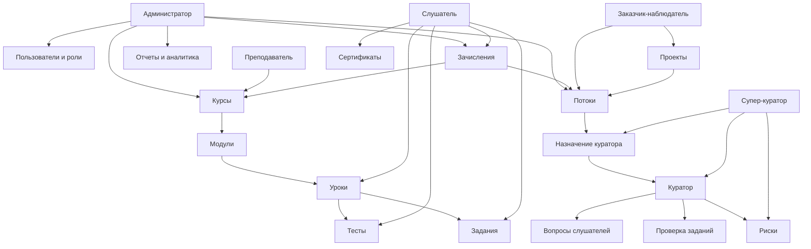

# Функциональное описание платформы AI Strategic Academy

Дата актуализации: 14 мая 2026

Этот документ описывает продуктовую логику платформы: назначение, роли, сценарии, разделы, связи между участниками и внешний UX/UI. Технический стек, инфраструктура, база данных, API и детали реализации здесь намеренно не описываются.

## 1. Назначение платформы

AI Strategic Academy — закрытая образовательная платформа для одной академии. Платформа управляет полным циклом обучения: выдача доступа, обучение по курсам, сопровождение слушателей, проверка заданий, тестирование, аналитика, отчеты и сертификаты.

Ключевая продуктовая идея: слушатель проходит обучение в одном кабинете, а команда академии видит ход обучения, риски, вопросы, задания и результаты по ролям.

Платформа не является публичным маркетплейсом курсов и не предполагает свободную регистрацию. Доступ выдается академией через заранее созданные учетные записи или инвайт-доступ.

## 2. Основные пользователи и роли

### Администратор

Администратор управляет всей академией. Это роль с полным операционным доступом.

Что делает:

- видит общую картину по курсам, потокам, пользователям, сертификатам и активности;
- управляет курсами и может открывать курс в редакторе;
- управляет пользователями, ролями и доступами;
- создает и контролирует потоки;
- управляет зачислениями слушателей;
- работает с инвайтами;
- смотрит аналитику и отчеты;
- просматривает аудит действий;
- управляет настройками платформы.

### Преподаватель

Преподаватель отвечает за учебный контент и экспертную часть обучения.

Что делает:

- видит свои курсы и аналитику по ним;
- создает и редактирует курсы;
- управляет модулями, уроками и материалами;
- создает тесты и задания;
- просматривает задания и связанные учебные активности;
- получает вопросы, переданные кураторами;
- готовит отчеты по своим курсам;
- отслеживает результаты слушателей по курсам и тестам.

### Слушатель

Слушатель проходит обучение.

Что делает:

- видит свой учебный дашборд;
- продолжает обучение с последнего доступного места;
- открывает свои курсы;
- проходит уроки, модули, тесты и задания;
- видит прогресс по курсу;
- получает дедлайны и уведомления;
- задает вопросы куратору из учебного процесса;
- получает ответы куратора;
- отправляет задания;
- проходит тесты;
- получает и скачивает сертификаты;
- управляет личными настройками.

### Куратор

Куратор сопровождает закрепленных слушателей и следит за тем, чтобы они не выпадали из обучения.

Что делает:

- видит список своих слушателей;
- отвечает на вопросы слушателей;
- проверяет задания;
- отслеживает риски по слушателям;
- видит дедлайны, прогресс и проблемные зоны;
- получает уведомления о вопросах и событиях;
- при необходимости передает вопрос преподавателю;
- формирует отчеты по зоне ответственности;
- управляет личными настройками.

### Супер-куратор

Супер-куратор управляет кураторской операционной частью: нагрузкой, распределением и качеством сопровождения.

Что делает:

- видит дашборд по кураторам и потокам;
- контролирует нагрузку кураторов;
- смотрит вопросы и проблемные очереди;
- управляет распределением слушателей;
- видит пользователей в зоне кураторской модели;
- отслеживает риски по потокам;
- смотрит аналитику и отчеты;
- может управлять учебными/операционными ролями без полного административного доступа.

### Заказчик-наблюдатель

Заказчик-наблюдатель — внешняя read-only роль для клиента или представителя проекта. Он видит результаты, но не управляет учебным процессом.

Что делает:

- смотрит дашборд проекта;
- видит прогресс по потокам;
- просматривает отчеты;
- видит сертификаты слушателей в разрешенной области;
- не редактирует курсы, пользователей, задания или оценки.

## 3. Связи ролей и объектов

Главная логика связей:

- курс состоит из модулей;
- модуль состоит из уроков;
- урок может содержать видео, текст, файлы, тест, задание, рейтинг и форму вопроса куратору;
- слушатель получает доступ к курсу через зачисление;
- зачисление может быть связано с потоком;
- поток задает учебную группу, дедлайны и кураторскую ответственность;
- куратор закрепляется за слушателем внутри потока;
- супер-куратор контролирует распределение и нагрузку кураторов;
- заказчик-наблюдатель видит только разрешенные проекты/потоки или, в legacy-режиме, всю отчетную область.

## 4. Общий пользовательский опыт

### Вход и доступ

Платформа начинается со страницы входа. Публичной витрины или лендинга нет: корневой сценарий — войти в закрытую академию.

Основные принципы доступа:

- самостоятельная регистрация закрыта;
- учетные записи выдаются академией;
- пользователь после входа автоматически попадает в кабинет своей основной роли;
- если у пользователя несколько ролей, приоритет кабинета: администратор, супер-куратор, куратор, преподаватель, заказчик-наблюдатель, слушатель;
- недоступные разделы перенаправляют на страницу отказа в доступе или страницу входа.

Публичные страницы:

- вход;
- закрытая регистрация с объяснением, что доступ выдает академия;
- восстановление пароля;
- сброс пароля;
- подтверждение email;
- публичная проверка сертификата;
- политика приватности;
- условия использования;
- согласие;
- страница отказа в доступе.

### Визуальный стиль

Интерфейс русскоязычный, рабочий и спокойный. Визуальная модель строится вокруг кабинетов по ролям:

- верхняя закрепленная шапка с брендом, уведомлениями, переключением темы и меню пользователя;
- боковая навигация на desktop;
- мобильное выезжающее меню на малых экранах;
- карточки метрик для быстрых чисел;
- табы для переключения рабочих очередей;
- таблицы для списков, отчетов и административных данных;
- бейджи статусов;
- прогресс-бары для курсов, модулей и потоков;
- пустые состояния, если данных еще нет;
- отдельное состояние, если дашборд временно недоступен.

UX ориентирован на быстрые рабочие действия: продолжить урок, открыть курс, проверить задание, ответить на вопрос, посмотреть риск, выгрузить отчет.

## 5. Учебная модель

### Курс

Курс — основная учебная единица. У курса есть название, описание, цель, обложка, длительность, статус, режим прохождения и порог завершения.

Статусы курса:

- черновик;
- опубликован;
- архивирован.

Режим прохождения:

- последовательный: следующий обязательный урок закрыт, пока не завершен предыдущий;
- открытый: уроки доступны без последовательной блокировки.

### Модуль

Модуль группирует уроки внутри курса. У модуля есть порядок, описание, рекомендованное количество дней и статус. Для потока у модуля может быть дедлайн.

### Урок

Урок — единица прохождения. В уроке могут быть:

- видео;
- текстовый материал;
- документы и файлы;
- тест;
- задание;
- форма вопроса куратору;
- рейтинг урока;
- кнопка завершения.

Типы уроков поддерживают видео, текст, документ, смешанный формат, тест, задание, live/recording-сценарии.

### Прогресс

Прогресс считается на трех уровнях:

- урок;
- модуль;
- курс.

Статусы прогресса:

- не начато;
- в процессе;
- завершено;
- заблокировано.

На дашборде слушателя главный сценарий — "продолжить обучение" с переходом к следующему доступному месту.

## 6. Проверка знаний и практики

### Тесты

Тесты используются для проверки знаний в рамках урока или курса.

Поддерживаемые типы вопросов:

- одиночный выбор;
- множественный выбор;
- true/false;
- текстовый ответ.

Для теста задаются:

- порог прохождения;
- максимальное количество попыток;
- список вопросов;
- результат попытки.

### Задания

Задания используются для практических работ и проверки куратором/командой.

Сценарий:

1. Преподаватель создает задание и инструкции.
2. Слушатель отправляет текстовый ответ и/или файл.
3. Куратор или ответственный проверяет работу.
4. Работа получает статус: отправлена, на проверке, принята, отклонена, требуется доработка.
5. Слушатель видит обратную связь и результат.

## 7. Сопровождение слушателей

### Вопросы

Слушатель может задать вопрос из контекста урока. Вопрос попадает куратору, закрепленному за слушателем.

Сценарии:

- куратор отвечает сам;
- куратор передает вопрос преподавателю;
- преподаватель отвечает на переданный вопрос;
- слушатель видит ответ в своем кабинете.

### Риски

Риски помогают операционной команде видеть проблемные места до того, как слушатель окончательно выпадет из обучения.

Примеры рисков:

- давно не заходил;
- давно не учился;
- модуль под риском;
- модуль просрочен;
- сертификат под риском.

Риски видят кураторы и супер-кураторы. Администратор видит общую картину через аналитику и отчеты.

## 8. Сертификаты

Сертификат подтверждает завершение курса. Сертификат связан со слушателем, курсом и, при наличии, зачислением.

Функции:

- список сертификатов в кабинете слушателя;
- список сертификатов в кабинете заказчика-наблюдателя;
- уникальный номер сертификата;
- публичная проверка сертификата по verification code;
- PDF-сценарий для скачивания/выдачи сертификата.

Публичная проверка показывает валидность сертификата без раскрытия лишних внутренних данных.

## 9. Отчеты и аналитика

Отчеты и аналитика разделены по ролям.

### Администратор

Видит общую аналитику:

- курсы;
- пользователи;
- роли;
- потоки;
- сертификаты;
- активность;
- отчеты по платформе.

### Преподаватель

Видит аналитику по своим курсам:

- прогресс по курсам;
- результаты тестов;
- вопросы от кураторов;
- учебные отчеты.

### Куратор

Видит операционную аналитику по закрепленным слушателям:

- прогресс;
- задания на проверке;
- вопросы;
- риски;
- отчеты по зоне ответственности.

### Супер-куратор

Видит кураторскую операционную аналитику:

- нагрузку кураторов;
- проблемные очереди;
- риски по потокам;
- распределение слушателей;
- отчеты по кураторской модели.

### Заказчик-наблюдатель

Видит только отчетную часть:

- прогресс по потокам;
- сертификаты;
- отчеты по разрешенным проектам или потокам.

## 10. Уведомления

Уведомления поддерживают учебные и операционные события:

- вопрос получен;
- вопрос передан;
- задание проверено;
- сертификат выдан;
- пароль изменен;
- другие события сопровождения.

Основной сценарий — in-app уведомления. Email-уведомления используются там, где они включены и имеют смысл для события.

## 11. Разделы платформы

### Общие публичные разделы

| Раздел | Назначение |
|---|---|
| `/` | Перенаправление к входу |
| `/login` | Вход в закрытую академию |
| `/register` | Сообщение о закрытой регистрации |
| `/forgot-password` | Запрос восстановления пароля |
| `/reset-password` | Установка нового пароля |
| `/verify-email` | Подтверждение email |
| `/certificates/verify/[verificationCode]` | Публичная проверка сертификата |
| `/privacy` | Политика приватности |
| `/terms` | Условия использования |
| `/consent` | Согласие |
| `/403` | Нет доступа |

### Кабинет слушателя

| Раздел | Назначение |
|---|---|
| `/student` | Дашборд: продолжить обучение, метрики, курсы, дедлайны, ответы куратора |
| `/student/my-courses` | Все курсы, куда зачислен слушатель |
| `/student/courses/[courseId]` | Страница курса: модули, уроки, прогресс, доступность |
| `/student/modules/[moduleId]` | ❌ Удалён — объединён со страницей курса `/student/courses/[courseId]` |
| `/student/lessons/[lessonId]` | Плеер урока: контент, тесты, задания, вопросы, навигация |
| `/student/assignments` | Список заданий |
| `/student/assignments/[assignmentId]` | Детали задания и отправка решения |
| `/student/quizzes` | Список тестов |
| `/student/quizzes/[quizId]` | Прохождение теста |
| `/student/quizzes/[quizId]/result` | Результат теста |
| `/student/notifications` | Уведомления |
| `/student/certificates` | Сертификаты слушателя |
| `/student/settings` | Профиль, уведомления, безопасность |

### Кабинет преподавателя

| Раздел | Назначение |
|---|---|
| `/instructor` | Дашборд преподавателя |
| `/instructor/courses` | Курсы преподавателя |
| `/instructor/courses/new` | Создание курса |
| `/instructor/courses/[courseId]/builder` | Единый редактор курса |
| `/instructor/courses/[courseId]/edit` | Настройки/редактирование курса |
| `/instructor/courses/[courseId]/curriculum` | Учебная структура курса |
| `/instructor/modules/[moduleId]/edit` | Редактирование модуля |
| `/instructor/lessons/[lessonId]/edit` | Редактирование урока |
| `/instructor/quizzes` | Тесты |
| `/instructor/quizzes/[quizId]/edit` | Редактирование теста |
| `/instructor/assignments` | Задания |
| `/instructor/assignments/[assignmentId]/edit` | Редактирование задания |
| `/instructor/questions` | Вопросы, переданные кураторами |
| `/instructor/reports` | Отчеты преподавателя |
| `/instructor/analytics` | Аналитика по курсам и тестам |
| `/instructor/settings` | Профиль, уведомления, безопасность |

### Кабинет куратора

| Раздел | Назначение |
|---|---|
| `/curator` | Дашборд: вопросы, задания, риски |
| `/curator/students` | Закрепленные слушатели |
| `/curator/questions` | Очередь вопросов |
| `/curator/assignments` | Проверка заданий |
| `/curator/risks` | Риски по слушателям |
| `/curator/reports` | Отчеты куратора |
| `/curator/analytics` | Аналитика по зоне ответственности |
| `/curator/settings` | Профиль, уведомления, безопасность |

### Кабинет супер-куратора

| Раздел | Назначение |
|---|---|
| `/super-curator` | Дашборд по кураторам и потокам |
| `/super-curator/curators` | Кураторы и их нагрузка |
| `/super-curator/questions` | Вопросы и очереди |
| `/super-curator/distribution` | Распределение слушателей и кураторов |
| `/super-curator/users` | Пользователи и учебно-операционные роли |
| `/super-curator/risks` | Риски по потокам |
| `/super-curator/reports` | Отчеты супер-куратора |
| `/super-curator/analytics` | Операционная аналитика |
| `/super-curator/settings` | Профиль, уведомления, безопасность |

### Кабинет администратора

| Раздел | Назначение |
|---|---|
| `/admin` | Главный дашборд академии |
| `/admin/courses` | Курсы |
| `/admin/courses/[courseId]/builder` | Редактор курса от имени администратора |
| `/admin/users` | Пользователи |
| `/admin/roles` | Роли и права |
| `/admin/cohorts` | Потоки |
| `/admin/cohorts/new` | Создание потока |
| `/admin/cohorts/[cohortId]` | Детали потока |
| `/admin/enrollments` | Зачисления |
| `/admin/invites` | Инвайт-доступ |
| `/admin/analytics` | Аналитика академии |
| `/admin/reports` | Отчеты |
| `/admin/audit` | Аудит |
| `/admin/audit-logs` | Журнал аудита |
| `/admin/payments` | Страница платежей/совместимости; для закрытой академии платежный сценарий не является основным |
| `/admin/settings` | Настройки платформы |

### Кабинет заказчика-наблюдателя

| Раздел | Назначение |
|---|---|
| `/customer-observer` | Дашборд проекта |
| `/customer-observer/reports` | Отчеты |
| `/customer-observer/certificates` | Сертификаты по доступной области |
| `/customer-observer/settings` | Профиль и настройки |

## 12. Администрирование доступа

Платформа использует роль как основной способ разделения интерфейса и действий.

Логика доступа:

- пользователь без входа не видит закрытые кабинеты;
- пользователь видит кабинет своей роли;
- административные функции доступны только администратору;
- преподаватель работает только с учебным контентом, который ему доступен;
- куратор работает со своей зоной сопровождения;
- супер-куратор управляет кураторской операционной частью;
- заказчик-наблюдатель имеет read-only доступ к отчетам, прогрессу и сертификатам;
- слушатель видит только собственное обучение.

## 13. Настройки пользователя

Настройки в ролевых кабинетах строятся вокруг трех ожидаемых блоков:

- профиль;
- уведомления;
- безопасность.

Типовые действия:

- посмотреть и обновить персональные данные;
- управлять предпочтениями уведомлений;
- изменить пароль;
- выйти из учетной записи.

## 14. Основные сквозные сценарии

### Сценарий: запуск нового курса

1. Администратор или преподаватель создает курс.
2. Создаются модули и уроки.
3. В уроки добавляются материалы, тесты и задания.
4. Курс публикуется.
5. Слушателей зачисляют в курс и поток.
6. За потоком назначаются кураторы.
7. Слушатели проходят обучение.
8. Команда отслеживает прогресс, вопросы, задания и риски.
9. После выполнения условий выдается сертификат.

### Сценарий: сопровождение слушателя

1. Слушатель проходит урок.
2. Если возникает вопрос, он задает его куратору.
3. Куратор отвечает или передает вопрос преподавателю.
4. Если слушатель отстает, появляется риск.
5. Куратор видит риск и может принять операционное действие.
6. Супер-куратор видит нагрузку и проблемы на уровне потоков.

### Сценарий: отчет для заказчика

1. Слушатели проходят обучение в рамках проекта или потока.
2. Заказчик-наблюдатель входит в свой кабинет.
3. Он видит прогресс, сертификаты и отчеты.
4. Он не может изменять учебный процесс или данные пользователей.

## 15. Продуктовые ограничения и текущие решения

- Платформа закрытая: публичная регистрация отключена.
- Платежный сценарий не является главным для текущего профиля академии.
- Основной язык интерфейса — русский.
- Главная страница не является лендингом: пользователь сразу идет к входу.
- У заказчика-наблюдателя read-only модель.
- Старые отдельные страницы редактирования курса/модуля/урока сохраняются как совместимые маршруты, но продуктовый вектор — единый редактор курса.
- Студенческие агрегаторы тестов и заданий существуют, но основной учебный поток должен оставаться внутри курса и урока.

## 16. Что важно сохранить при развитии

- Закрытая модель доступа и контроль выданных аккаунтов.
- Четкое разделение ролей.
- Быстрый путь слушателя к продолжению обучения.
- Единый учебный контекст: курс, модуль, урок, тест, задание, вопрос.
- Операционная видимость для куратора и супер-куратора.
- Read-only прозрачность для заказчика.
- Простая навигация по ролям без перегруженного общего меню.
- Чистые статусы: курс, прогресс, задание, сертификат, риск.
- Отчеты и аналитика как поддержка управленческих решений, а не отдельная перегруженная BI-система.
