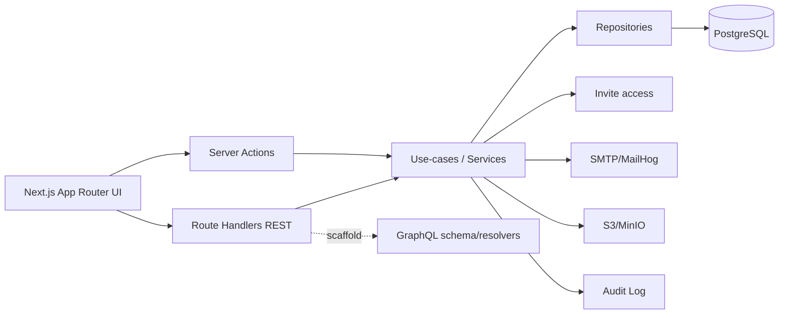
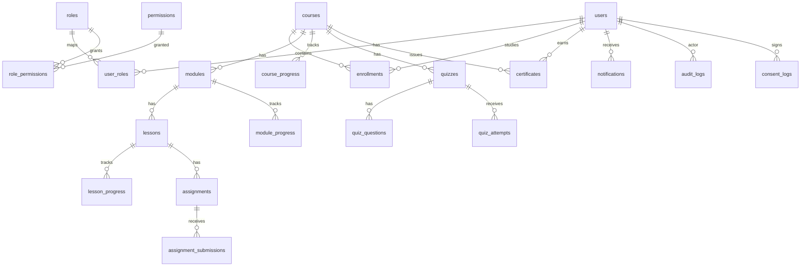
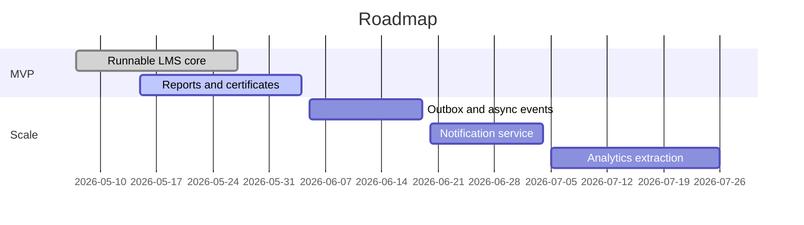

# Executive Summary

AI Strategic Academy — закрытая LMS одной академии для управления курсами, потоками, кураторами, прогрессом, заданиями, сертификатами, инвайт-доступом и отчётностью. Основная реализация — Next.js modular monolith с REST API, Prisma/PostgreSQL и русским интерфейсом. Microservices-режим поставляется как reference architecture для будущего масштабирования.

# Требования

| MVP feature | Статус | Примечание |
|---|---|---|
| Аутентификация email/password и OAuth | Реализуется | Auth.js, Google/GitHub examples |
| RBAC | Реализуется | `admin`, `instructor`, `student`, `curator`, `super_curator`, `customer_observer` |
| Курсы/модули/уроки | Реализуется | Draft/published/archived |
| Прогресс и continue learning | Реализуется | Lesson/module/course progress |
| Тесты и задания | Реализуется | Autograding, attempts, submissions |
| Сертификаты | Реализуется | Unique number, verification URL, PDF scaffold |
| Invite-only access | Реализуется | Инвайт-ссылки; Stripe checkout/webhook endpoints оставлены как `410 Gone` compatibility |
| Аналитика/отчёты | Реализуется | Export-ready data shape |
| Поиск | Реализуется | PostgreSQL full-text boundary |
| Уведомления | Реализуется | In-app + email event abstraction |

| Роль | Основные права |
|---|---|
| admin | Полный доступ, настройки, аудит, роли |
| instructor | Управление курсами, уроками, тестами, заданиями |
| student | Обучение, прогресс, тесты, сертификаты |
| curator | Проверка заданий, вопросы, риски по слушателям |
| super_curator | Распределение кураторов, риски потоков |
| customer_observer | Read-only отчёты по проекту/потоку |

# Архитектура



| Stack | Назначение | Статус |
|---|---|---|
| Next.js | Primary full-stack implementation | Полный runnable core |
| Django | Alternative scaffold | Не генерируется при `--stack=nextjs` |
| Node/Express | Alternative scaffold | Не генерируется при `--stack=nextjs` |
| Microservices | Reference extraction architecture | Starter contracts/services |

# Схемы БД



Основные таблицы: `users`, `roles`, `permissions`, `user_roles`, `role_permissions`, `oauth_accounts`, `courses`, `course_instructors`, `modules`, `lessons`, `lesson_media`, `cohorts`, `cohort_deadlines`, `enrollments`, `lesson_progress`, `module_progress`, `course_progress`, `quizzes`, `quiz_questions`, `quiz_attempts`, `assignments`, `assignment_submissions`, `certificates`, `invite_links`, `notifications`, `audit_logs`, `consent_logs`, `app_settings`.

# API спецификация

| Endpoint | Method | Назначение |
|---|---|---|
| `/api/v1/healthz` | GET | Liveness |
| `/api/v1/readyz` | GET | Readiness |
| `/api/v1/auth/register` | POST | Регистрация |
| `/api/v1/auth/forgot-password` | POST | Запрос сброса |
| `/api/v1/auth/reset-password` | POST | Сброс пароля |
| `/api/v1/me` | GET | Текущий профиль |
| `/api/v1/courses` | GET/POST | Курсы |
| `/api/v1/courses/{id}` | GET/PATCH | Курс |
| `/api/v1/courses/{id}/modules` | POST | Модули |
| `/api/v1/modules/{id}/lessons` | POST | Уроки |
| `/api/v1/enrollments` | GET/POST | Зачисления |
| `/api/v1/quizzes/{id}/attempts` | POST | Попытка теста |
| `/api/v1/assignments/{id}/submissions` | POST | Сдача задания |
| `/api/v1/progress` | GET/POST | Прогресс |
| `/api/v1/certificates` | GET/POST | Сертификаты |
| `/api/v1/payments/checkout` | POST | Disabled invite-only compatibility endpoint, `410 Gone` |
| `/api/v1/webhooks/stripe` | POST | Disabled invite-only compatibility endpoint, `410 Gone` |
| `/api/v1/analytics` | GET | Аналитика |
| `/api/v1/audit-logs` | GET | Аудит |
| `/api/v1/notifications` | GET | Уведомления |
| `/api/v1/search` | GET | Поиск |

# Структура проекта

`app/` содержит страницы и Route Handlers. `server/modules/` содержит use-cases и интеграции. `lib/` содержит общие typed utilities. `prisma/` содержит схему, миграцию и seed. `services/` содержит microservices reference. `infra/` содержит Docker/Kubernetes templates.

# Примеры кода

```ts
await requirePermission(["courses:write"]);
const course = await createCourse(input, actorId);
```

```ts
const result = gradeObjectiveQuiz(questions, answers, passThreshold);
```

# Инструкции по развертыванию

Локально: скопировать `.env.example` в `.env`, поднять Docker Compose зависимости, выполнить `npm.cmd install`, `npm.cmd run db:push`, `npm.cmd run db:seed`, `npm.cmd run dev`.

Production: задать реальные `DATABASE_URL`, `NEXTAUTH_SECRET`, `NEXTAUTH_URL`, `APP_URL`, OAuth secrets, SMTP и S3 vars. Для Vercel использовать managed Postgres/S3/SMTP; Stripe secrets не требуются для текущего invite-only профиля. Для Docker/K8s использовать `Dockerfile`, `docker-compose.yml`, `infra/k8s`.

# План миграции и масштабирования

1. Запустить modular monolith.
2. Вынести async-события через outbox.
3. Первым выделять notification-service и analytics-reporting-service.
4. Invite access отделять только после стабилизации lifecycle, audit trail и лимитов активации.
5. Course/progress domains разделять после появления независимых SLA.



# Список задач для MVP и roadmap

См. `docs/todo.md`. MVP закрывает runnable core, роли, курсы, прогресс, тесты, задания, сертификаты, инвайты, отчёты, аудит, согласия, i18n и deployment templates.

# Риски и рекомендации по безопасности

Основные риски: утечка персональных данных, обход ролей, случайная реактивация платежей, XSS в учебном контенте, слабая настройка секретов. Рекомендации: серверный RBAC, структурированный контент, explicit disabled billing endpoints, env-only secrets, audit logs, rate limiting, регулярные backup/restore drills.
